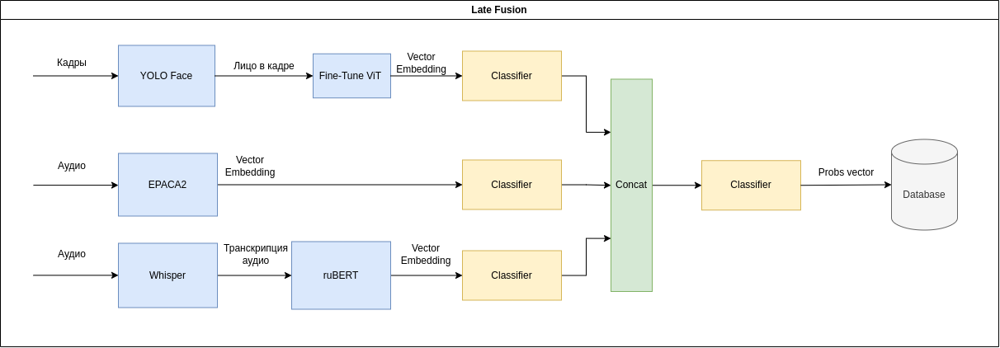

# Подбор кандидатов на вакансию по типу личности
> Данный репозиторий является решением команды **ZhимоVики** на хакатоне *Цифровой прорыв 2024: сезон ИИ (Международный хакатон)*.

---
### PersonScout - scout of personal qualities
---

## Содержание

- [Задача](#Задача)
- [Концепция решения](#Концепция-решения)
- [Модель](#Модель)
- [Точность модели](#Точность-модели)
- [Работа модели и адаптивность](#Работа-модели-и-адаптивность)
- [Стек технологий](#Стек-технологий)
- [Сборка и запуск проекта](#Сборка-и-запуск-проекта)
- [О команде](#О-команде)

---

## Задача
> Создать систему подбора кандидатов работодателю по типу личности по видеовизитке

На основе датасета создать систему, которая может по видеовизитке кандидатов определять:
+ К какому из типу личностей относится кандидат
+ Предлагать работодателю подходящих кандидатов для данной специальности согласно их типу личности
+ Трансформировать результаты модели из системы OCEAN в систему MBTI (алгоритм трансформации должен опираться на официальные методы)

---

## Концепция решения

Подход к решению задачи заключается в разбиении видео на потоки информации и их независимой обработке. Выделены три информационных потока:
- Из видео производится выборка кадров, затем изменяется размер кадров.
- Из видео выделяется одноканальная аудиозапись с заданной частотой дискретизации.
- Аудиозапись переводится в текст

---

## Модель

При обучении модель извлекает эмбеддинги из потока кадров и аудиозаписи. Векторы разных модальностей конкатенируются и подаются в классификатор. Модель предсказывает пять значений OCEAN.



---

## Точность модели

macroF1 = 0.34

mAcc = 0.81

---

## Работа модели

Сервис может рекомендовать кандидатов на вакансию на основе предоставленных в качестве примера видеовизиток.

---

## Стек технологий

+ [Python 3.10](https://www.python.org/)
+ [NumPy](https://numpy.org/)
+ [PyTorch](https://pytorch.org/)
+ [Triton inference server](https://developer.nvidia.com/triton-inference-server)
+ [django](https://www.djangoproject.com/)
+ [Nginx](https://nginx.org/ru/)
+ [Redis](https://github.com/redis/redis)
+ [PostgreSQL](https://www.postgresql.org/)
+ [OpenCV](https://opencv.org/get-started/)


---

## Сборка и запуск проекта

> ### Требуется Python 3.10.12

### 1. Клонировать репозиторий
```bash
git clone git@github.com:zibestr/PersonScout.git
```

### 2. Запуск в Docker
```bash
docker compose up -d --build
```

---

## О команде

- [Яшин Данила](https://github.com/zibestr) (Team Lead, ML Engineer)
- [Основин Александр](https://github.com/PyAlexOs) (Backend, Data Engineer)
- [Егоров Леонид](https://github.com/Grander78498) (DevOps, Backend)
- [Корольков Александр](https://github.com/adkorolkov) (MLOps, Backend)
